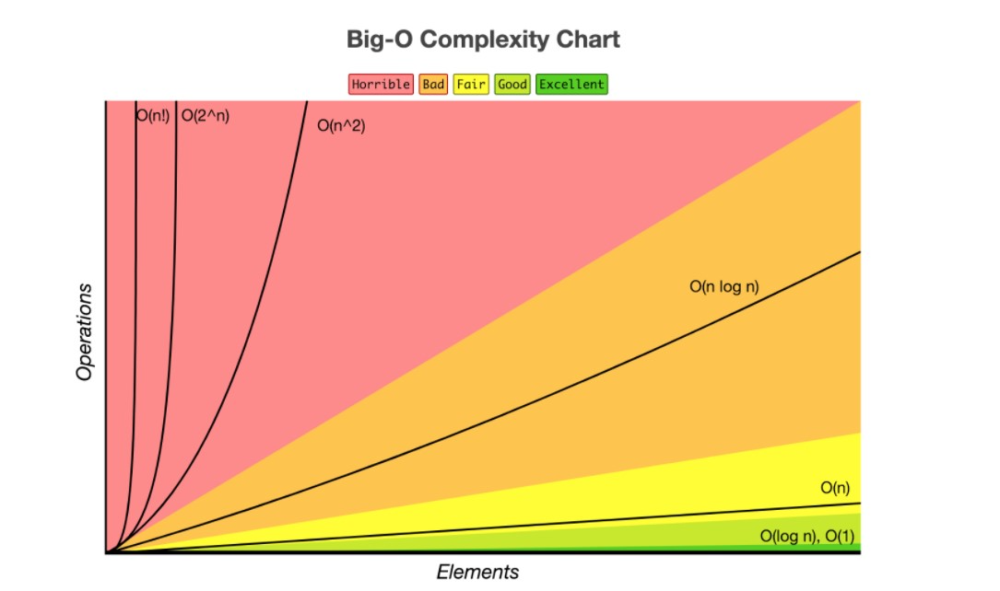

# machine-learning-production
Repo for the MBA - MLP contents

# ESBD

## AEDs
### 1. Big-O: Algorithms Complexity



### 2. Recurssion 

#### Fibonnaci 

$$f(0) = 0$$
$$f(1) = 1$$
$$f(n) = f(n-1)+f(n-2)$$


- O cálculo recursivo ***naive*** da Finbonnaci é ineficiente
$$2ˆ(n/2)<=T(n)<=2ˆn$$

```
PROGRAM FibRec(n):
    if n == 0:
        return 0;
    else if n == 1:
        return 1;
    else:
        return FibRec(n-1) + FibRec(n-2)
```

- Cáclculo usando um vetor (recursão com memorização ~ programação dinâmnica)
$$T(n)~O(n)$$


```
PROGRAM FibRecMem(n):
    global Mem[0,n] = [0, 1, None(1), None(2), ... , None(n)]
    if n == 0:
        return 0;
    else if n == 1:
        return 1;
    else if Mem[n] == None:
        Mem[n] = FibRecMem(n-1) + FibRecMem(n-2)
    else:
        return Mem[n]
```

- Algoritmo para cálculo de recursão usando programação dinâmica

```
PROGRAM PD_Fib(n):
    a: int = 0 
    b: int = 1 
    if n == 0:
        return 0;
    else if n == 1:
        return 1;
    for i in [0,1,...,n]:
        c = a + b 
        a = b 
        b = c 
    return c 
```

- [Fibonacci Notebok](./esbd/aeds/notebooks/fib.ipynb)

### Vetores e Listas encadeadas (ligadas)

#### Vetores:
  * Indexável => Acesso arbitrário com tempo constante.
  * acessos:
    * '+' acesso arbitrário: O(1)
    * '++' acesso sequencial: T(n)
  * Inserção / remoção
    * '-' inserção e remoção no inicio / meio do vetor:
      * é necessário realocar todos os elementos para espaços de memória e criar uma posição ao final do array para poder alocar um elemento: O(n)
      * o complementar é válido para remoção (deslocar elementos)
      * PQ: No vetor os blocos de memnória são contíguos
#### Listas ligadas / encadeadas:


* Acessos:
  * '-' acesso arbitrário: O(n)
  * '+' acesso sequencial: T(n)*k, k > 1
  * inserção / remoção:
    * Blocos de memória não são contíguos, a relação entre os blocos é lógica.
    * Basta alocar um novo bloco de memória e criar uma relação lógica entre o bloco: O(1)

#### Algoritmos de busca linear e binária 
* Linear:
  * acessa o idx 0, avalia se é igual ao elemento buscado
    * sim, end
    * não, idx += 1, repete
    * O(n) - proporcional ao tamanho / posição do elemento buscado
    * Se aplica para vetores e listas ligadas

### Algoritmos de Ordenação (TODO)